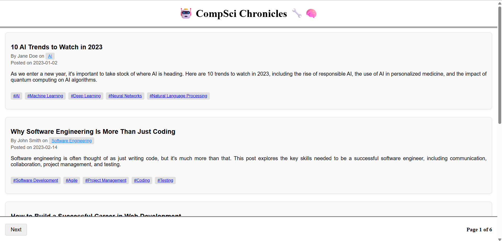
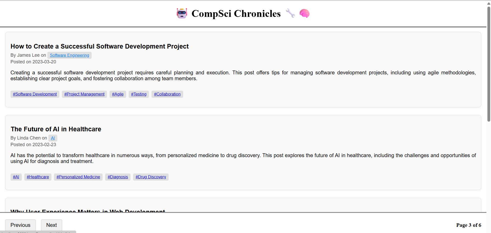
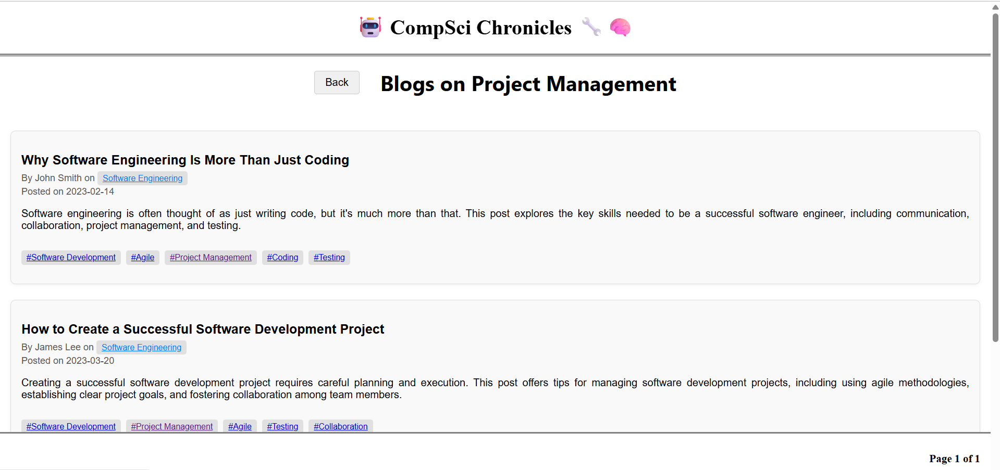

## Blog Application (React)

**Overview**
*This is a fully responsive React-based Blog Application that fetches blog data from an external API and displays it with a clean, user-friendly interface. The application supports pagination, hashtag-based filtering, and smooth navigation between blog lists while preserving the user’s browsing state.*

**Features**
   1. Blog Listing
       - Displays blogs fetched from an API
       - Each blog includes:
         - Blog heading/title
         - Author name
         - Blog type/category
         - Publishing date
         - Associated hashtags

   2. Pagination
       - Proper pagination with:
         - Next and Previous navigation buttons
         - Page indicator (for example: Page 1 of 6)
       - Pagination updates dynamically based on available blog data

   3. Hashtag-Based Filtering
       - Clicking on any hashtag opens blogs related to that hashtag
       - Filtered results have their own pagination
         - Example: If a hashtag has only two pages, pagination shows Page 1 of 2

   4. Navigation State Management
      - Includes a Back button when viewing hashtag-filtered blogs
      - Returns the user to the exact page they were previously on
        - Example: If the user was on Page 4 out of 6 before clicking a hashtag, they are returned to Page 4 when navigating back

   5. Responsive Design
     - Fully responsive layout
     - Optimized for:
       - Desktop
       - Tablet
       - Mobile devices

**User Experience Highlights**
   - Smooth transitions between pages

   - No loss of pagination state during navigation

   - Clean and readable blog layout

   - Intuitive hashtag exploration

**Screenshots**

## Screen 1

## Screen 2

## Screen 3

**Technology Stack**
   - React

   - JavaScript

   - Blog API for blog data

   - Responsive CSS (Flexbox/Grid)

**Project Structure**
   - Modular and reusable React components
   - Separation of concerns for:
      - Blog list
      - Pagination
      - Hashtag filtering
      - Navigation handling

**Use Case**
This project is ideal for:
   - Blog platforms
   - Content-heavy websites
   - Learning advanced pagination and state handling in React
   - Demonstrating real-world React application architecture

**Author**
   *- Sourabh (https://github.com/Sourabh108-Coder)*
